# SF6 対戦アシスタント — システムアーキテクチャ

> 最終更新: 2026-05-19

---

## 全体構成図

```mermaid
%%{init: {'theme': 'base', 'themeVariables': {'fontSize': '13px'}}}%%
flowchart TB

    %% ========== 外部データソース ==========
    CAPCOM_SITE(["🌐 CAPCOM 公式サイト\nstreetfighter.com\nbattle_change / character/{slug}/frame"])
    SC_CARGO(["🌐 SuperCombo Wiki\nCargo API\nJSON ダウンロード (手動・月次)"])
    SC_DOCS(["🌐 SuperCombo Wiki\nGame Mechanics ページ\nHTML 手動取得 (Cloudflare 対策)"])

    %% ========== AWS (Layer 1) ==========
    subgraph AWS["☁️  AWS  ap-northeast-1 (東京)"]
        direction TB
        EB["⏰ EventBridge\nsf6-frame-daily-detection\ncron(0 18 * * ? *)  =  JST 03:00 毎日"]
        subgraph LAMBDA_BOX["Lambda: sf6-frame-scraper\nPython 3.12 / 512MB / timeout 10分"]
            direction LR
            L1["① battle_change ページから\n最新パッチ日付を取得"]
            L2["② patches テーブルと比較\n未知パッチなら全キャラ起動"]
            L3["③ 全キャラ frame ページを\nスクレイプ・パース"]
            L1 --> L2 --> L3
        end
        SM["🔑 Secrets Manager\nsf6-frame-scraper/supabase\n(Supabase URL + service_role key)"]
        CWL["📋 CloudWatch Logs\n/aws/lambda/sf6-frame-scraper\n保持: 30 日"]
        EB --> LAMBDA_BOX
        LAMBDA_BOX -->|"boto3\n認証情報取得"| SM
        LAMBDA_BOX --> CWL
    end

    %% ========== Supabase ==========
    subgraph SUPA["🗄️  Supabase  (PostgreSQL 15 + pgvector)"]
        direction TB

        subgraph STORAGE["Storage"]
            S_BUCKET["sf6-html-archive\n(private)\ncurrent/ 30件  previous/ 28件\n各 ~400KB HTML"]
        end

        subgraph DB["Database"]
            direction LR
            subgraph LAYER1_DB["Layer 1 テーブル (Lambda が書き込み)"]
                T_PATCHES["patches\nパッチ履歴"]
                T_CHARS["characters\nキャラ一覧 30件"]
                T_SNAP["move_snapshots\nCAPCOM公式フレームデータ\nraw_html_uri → Storage 参照"]
                T_RUNS["scrape_runs\n実行ログ"]
            end
            subgraph LAYER3_DB["Layer 3 テーブル (手動インポート)"]
                SC_M["sc_moves\n必殺技・SA 生データ\n2,118件 / 30キャラ"]
                SC_N["sc_move_normalized\nフレーム数値ビュー\n(startup_f / block_adv_f 等)"]
                DOC["doc_chunks\nゲームシステム文書\n72チャンク + pgvector"]
                SLUG["char_slug_map\nキャラ名対応表 30件"]
            end
            UNIFIED["unified_moves\nCAPCOM + SC 統合ビュー\n(SQL VIEW)"]
            T_SNAP --> UNIFIED
            SC_N --> UNIFIED
        end
    end

    %% ========== sf6_engine (Layer 3) ==========
    subgraph ENGINE["⚙️  sf6_engine  (Layer 3 / ローカル CLI)"]
        direction TB
        IP["🧠 Intent Parser\n日本語クエリ → 構造化 JSON\nintent_type / chara / move_name"]
        RAG["📦 RAG Context Builder\n_fetch_move_by_name\n_pick_variant (強度・OD判定)\n派生割り込み計算"]
        CE["♟ Combo Engine\nビームサーチ 最大コンボ\n(beam_width=8, max_depth=7)"]
        SP["🎯 Setplay Engine\nKD有利 − 前ステップF\nダッシュF は doc_chunks から取得"]
        ANS["💬 Answer Generator\nコンテキスト + クエリ → 最終回答"]

        IP --> RAG
        RAG --> CE
        RAG --> SP
        RAG --> ANS
    end

    %% ========== LLM ==========
    subgraph LLM["🤖 LLM (現在: ローカル)"]
        OLLAMA["Ollama\ngemma4:e2b  —  Intent解析・回答生成\nnomic-embed-text  —  ベクトル埋め込み"]
    end

    subgraph LLM_AWS["🤖 LLM (AWS 移行候補)"]
        BEDROCK["Amazon Bedrock\nGemma3 4B~12B\n~$2〜3 / 月 (2,000クエリ想定)"]
    end

    %% ========== ユーザー ==========
    USER(["👤 ユーザー\npython -m sf6_engine.cli ask\n\"ケンの中迅雷脚の弱派生前は割り込める?\""])

    %% ========== データフロー: Layer 1 ==========
    CAPCOM_SITE -->|"HTTP スクレイプ\n(3秒間隔・礼儀的)"| LAMBDA_BOX
    LAMBDA_BOX -->|"UPSERT"| T_PATCHES
    LAMBDA_BOX -->|"UPSERT"| T_CHARS
    LAMBDA_BOX -->|"UPSERT"| T_SNAP
    LAMBDA_BOX -->|"HTML ローテーション保存\ncurrent → previous"| S_BUCKET
    T_SNAP -.->|"raw_html_uri で参照"| S_BUCKET

    %% ========== データフロー: 手動インポート ==========
    SC_CARGO -->|"importers/supercombo.py\n(月次手動)"| SC_M
    SC_DOCS  -->|"importers/docs.py\n+ nomic-embed-text\n(月次手動)"| DOC

    %% ========== データフロー: Layer 3 (クエリ処理) ==========
    USER --> IP
    IP  <-->|"Intent 解析\n(structured JSON)"| OLLAMA
    ANS <-->|"最終回答生成"| OLLAMA
    RAG <-->|"ベクトル埋め込み\n(explain_concept / general_question)"| OLLAMA

    RAG --> SC_M
    RAG --> SC_N
    RAG --> UNIFIED
    RAG --> DOC
    RAG --> SLUG
    CE  --> SC_N
    SP  --> DOC

    ANS --> USER

    %% ========== AWS 移行 ==========
    OLLAMA -. "BedrockProvider\nを実装して切替" .-> BEDROCK

    %% ========== スタイル ==========
    classDef aws_svc  fill:#fef3c7,stroke:#d97706,color:#78350f
    classDef supa_tbl fill:#dcfce7,stroke:#16a34a,color:#14532d
    classDef supa_str fill:#d1fae5,stroke:#059669,color:#064e3b
    classDef engine   fill:#f3e8ff,stroke:#9333ea,color:#3b0764
    classDef llm      fill:#dbeafe,stroke:#3b82f6,color:#1e3a5f
    classDef user     fill:#fce7f3,stroke:#ec4899,color:#831843
    classDef ext      fill:#f1f5f9,stroke:#64748b,color:#1e293b

    class EB,SM,CWL aws_svc
    class T_PATCHES,T_CHARS,T_SNAP,T_RUNS,SC_M,SC_N,DOC,SLUG,UNIFIED supa_tbl
    class S_BUCKET supa_str
    class IP,RAG,CE,SP,ANS engine
    class OLLAMA,BEDROCK llm
    class USER user
    class CAPCOM_SITE,SC_CARGO,SC_DOCS ext
```



---

## クエリ処理フロー (sf6_engine)

```
ユーザー入力
    │
    ▼
Intent Parser  ──[generate_structured()]──▶  Ollama (gemma4:e2b)
    │                                         ↑毎クエリ 1回
    │  intent_type を判定
    │
    ├─ lookup_move / punish_check
    │       └─ _fetch_move_by_name()
    │              ├─ Special/Super を直接 ILIKE 検索 (ハードコーディング不要)
    │              ├─ _pick_variant() で弱/中/強/OD を自動判定
    │              └─ 派生技の割り込み隙間を自動計算
    │
    ├─ combo_info
    │       └─ _fetch_combo_data() → sc_moves (hit_adv 生文字列)
    │              └─ _find_combo_follow_ups() → sc_move_normalized
    │                     └─ 派生技フレームデータ (input~% パターン)
    │
    ├─ max_combo
    │       └─ Combo Engine
    │              └─ BeamSearch (beam_width=8, max_depth=7) → sc_move_normalized
    │
    ├─ setplay_analysis
    │       └─ Setplay Engine
    │              ├─ KD有利を hit_adv 生文字列からパース ('KD +27' → 27)
    │              ├─ 前ステップF を doc_chunks から全キャラ分取得・キャッシュ
    │              └─ fetch_setplay_options() → sc_move_normalized
    │
    └─ explain_concept / general_question
            └─ _search_docs()
                   ├─ キーワード検索 (heading_h2/h3 ILIKE)
                   └─ ベクトル検索 ──[embed()]──▶ Ollama (nomic-embed-text)
                                                   ↑概念系クエリのみ
    │
    ▼
Answer Generator  ──[generate()]──▶  Ollama (gemma4:e2b)
    │                                  ↑毎クエリ 1回
    ▼
ユーザーへの回答
```

---

## データ収集フロー (Layer 1)

```
【自動 / 毎日 JST 03:00】
EventBridge (cron)
    └─▶ Lambda: sf6-frame-scraper
            │
            ├─ Secrets Manager から Supabase 認証情報を取得 (boto3)
            │
            ├─ CAPCOM battle_change ページを取得
            │       └─ patches テーブルと比較
            │              ├─ 変化なし → 2〜3秒で終了 (毎日はこちら)
            │              └─ 新パッチ検知 → 全キャラスクレイプ起動 (10〜13秒)
            │
            └─ [新パッチ時のみ] 全30キャラ処理
                    ├─ characters UPSERT
                    ├─ move_snapshots UPSERT (フレームデータ)
                    ├─ Supabase Storage ローテーション
                    │       current/{slug}.html → previous/{slug}.html
                    │       新HTML → current/{slug}.html
                    └─ scrape_runs にログ記録

【手動 / 月次】
SuperCombo Wiki Cargo API (JSON)
    └─▶ importers/supercombo.py → sc_moves (2,118件)

SuperCombo Wiki ゲームシステムページ (HTML)
    └─▶ importers/docs.py
            ├─ h2/h3 単位でチャンク分割
            ├─ nomic-embed-text でベクトル化
            └─▶ doc_chunks (72チャンク)
```

---

## AWS リソース一覧

| リソース | 種別 | 状態 |
|---|---|---|
| `sf6-frame-scraper` | Lambda (Python 3.12 / 512MB) | 稼働中 |
| `sf6-frame-daily-detection` | EventBridge Rule (JST 03:00 毎日) | ENABLED |
| `sf6-frame-scraper/supabase` | Secrets Manager | 稼働中 |
| `/aws/lambda/sf6-frame-scraper` | CloudWatch Logs (保持30日) | 稼働中 |
| `sf6-frame-scraper` | CloudFormation Stack | UPDATE_COMPLETE |

**※ AWS S3 は使用していない。** HTML 保存先は Supabase Storage (`sf6-html-archive`)。

---

## Supabase リソース一覧

| リソース | 種別 | 件数 / サイズ |
|---|---|---|
| `sf6-html-archive` | Storage バケット (private) | current/ 30件 + previous/ 28件 / 各 ~400KB |
| `sc_moves` | テーブル | 2,118件 (30キャラ) |
| `sc_move_normalized` | VIEW | sc_moves を整数化 |
| `unified_moves` | VIEW | CAPCOM + SC 統合 |
| `move_snapshots` | テーブル | CAPCOM公式フレームデータ |
| `doc_chunks` | テーブル + pgvector | 72チャンク |
| `char_slug_map` | テーブル | 30件 |
| `patches` / `characters` / `scrape_runs` | テーブル | Layer 1 管理用 |

---

## LLM 移行コスト比較 (月2,000クエリ想定)

| 構成 | 月額 | 特記 |
|---|---|---|
| **Ollama ローカル (現在)** | $0 | PC 依存・常時起動が必要 |
| **Bedrock Gemma3 12B (生成) + ローカル埋め込み** | ~$2.70 | 差額 $0.002 のため分ける意味は薄い |
| **Bedrock Gemma3 12B (生成 + 埋め込み)** | ~$2.70 | 構成がシンプル |
| **EC2 g4dn.xlarge (手動起動)** | ~$10〜50 | Gemma4 対応・起動管理が必要 |

`LLMProvider` 抽象化済み → `BedrockProvider` クラス追加 + `.env` に `LLM_PROVIDER=bedrock` で切替可能。

---

## ファイル構成

```
sf6-data-viewer/
├── streetfighter6-frame-data/          # Layer 1 (AWS Lambda)
│   ├── lambda_function.py              # スクレイパー本体
│   ├── template.yaml                   # SAM テンプレート
│   └── samconfig.toml                  # デプロイ設定 (region: ap-northeast-1)
│
└── streetfighter6-engine/              # Layer 3 (sf6_engine CLI)
    ├── src/sf6_engine/
    │   ├── cli.py                      # ask コマンド
    │   ├── intent_parser.py            # 日本語 → Intent JSON
    │   ├── rag_builder.py              # コンテキスト構築・回答生成
    │   ├── combo_engine.py             # ビームサーチ最大コンボ
    │   ├── setplay_engine.py           # KD後起き攻め計算
    │   ├── llm_provider.py             # LLMProvider 抽象基底
    │   ├── ollama_provider.py          # Ollama 実装 (現在使用)
    │   └── importers/
    │       ├── supercombo.py           # sc_moves インポーター
    │       └── docs.py                 # doc_chunks インポーター
    └── sql/
        ├── sf6_engine_schema_v2.sql    # sc_moves / normalized / unified_moves
        └── doc_chunks_schema.sql       # doc_chunks + pgvector 関数
```
