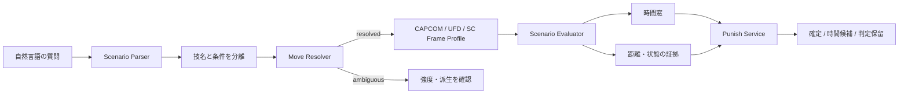

# 状況付きフレーム回答の設計

## 目的

基準フレーム表の転記と、実戦状況に対する推論を分離する。質問に条件がある場合は、
条件を無視して基準値を返さず、次の3段階を独立に判定する。

1. 質問条件を解釈できたか
2. 対象技を一意に特定できたか
3. その条件で数値または確反成立を証明できたか



## Scenario 契約

`intent_parser` は質問に明示された条件だけを `scenario` へ保存する。未指定値を勝手に
`normal` や `midscreen` で埋めない。

```json
{
  "schema_version": 1,
  "distance": "tip",
  "contact_timing": "active_frame",
  "active_frame": 2,
  "interaction": "block",
  "perspective": "defender",
  "specified": ["distance", "contact_timing", "active_frame", "interaction", "perspective"],
  "evidence": {
    "distance": "先端",
    "contact_timing": "持続2F目"
  },
  "ambiguities": []
}
```

現在抽出する条件は距離、数値距離、接触持続F、連携段数、立ち/しゃがみ/空中、
通常/カウンター/パニカン、防御側バーンアウト、raw/キャンセルDR、画面端、block/hit、
攻撃側/防御側視点。バーンアウトしている側など主語が不明な条件は `ambiguities` に残す。

## 自然言語と技IDの境界

技名は入力完全一致、正式名完全一致、variant alias、family aliasの順に解決し、解決手段と
候補を返す。`波動拳` のように弱中強へ分岐するfamily名は強度を確認するまで計算しない。
一方、`シベリアンエクスプレス（遠距離版）` や `不破三連撃（2段目）` の括弧内は
正式variant名の一部なので、距離・段数のscenarioへ誤って移さない。LLMは表現の補助には
使えても、技候補の一意選択や数値の条件選択は行わない。

## 数値の状態

| status | 意味 | 計算利用 |
|---|---|---|
| `source_exact` | 原典の単一基準値 | 可 |
| `derived_exact` | 適用条件と式が一意な派生値 | 可 |
| `condition_selected` | 段階別値から明示段を選択 | 可 |
| `interval` / `derived_interval` | 端点条件または接触Fが未確定 | 不可 |
| `conditional_unresolved` | 条件と値、またはシステムルールの結合がない | 不可 |
| `invalid_condition` | 指定持続Fや段数がデータ範囲外 | 不可 |
| `move_ambiguous` | 技の強度・派生が一意でない | 不可 |
| `data_missing` | 3ソースに観測値がない | 不可 |

通常技の基準有利差が単一値で、持続も単一の連続区間として取得できる場合のみ、
接触が1F遅れるごとに有利差を1F加算する。先端だけが指定され、何F目の持続か不明なら、
可能な区間を表示して確反計算は止める。飛び道具、着地を含む技、条件付き原典値、
未登録のBurnout/DR補正は推測しない。

## 確反の証明レベル

| 判定 | 時間窓 | 到達/状態 | 出力 |
|---|---|---|---|
| `no_frame_window` | 反撃窓なし | 不要 | 確反なし |
| `timing_unresolved` | 未確定 | 未検証 | 判定保留 |
| `timing_only_spatial_unverified` | 発生上限を確定 | 未検証 | フレーム上の候補 |
| 将来 `confirmed` | 発生上限を確定 | 実測またはgeometryで証明 | 確定反撃 |

候補列挙ではジャンプ技、ターゲットコンボ途中、派生入力を除く。残る技にも
`reach_status`、`neutral_availability_status`、`resource_requirement` を付ける。

## 永続データ

追加DDLは `sql/contextual_frame_model_migration.sql`。既存のCAPCOM/UFD/SC表はそのまま残す。

| テーブル | 責務 |
|---|---|
| `canonical_moves` | variantを含む正規技ID |
| `move_source_links` | 各原典行との対応とmatch根拠 |
| `canonical_move_aliases` | 自然言語aliasと要確認family |
| `frame_observations` | 条件・型・視点・出典付きフレーム値 |
| `system_rule_observations` | パッチ単位のBurnout/DR等の構造化ルール |
| `interaction_observations` | 接触F、前後距離、状態、結果の実測 |
| `move_geometry_samples` | GIFからレビュー済みで抽出したframe別box/reach |
| `punish_observations` | 技対技・scenario別の直接確反実測 |
| `move_transition_observations` | cancel/chain/link/juggle等の合法な技遷移 |
| `combo_link_observations` | 技A→技B・scenario別の直接コンボ実測 |
| `sequence_observations` | 複数イベント、相手キャラ+技まで特定した相打ち後有利、確認済み追撃のレビュー済み観測 |

UFD GIFのバイナリは引き続きprivate Storageに置く。GIFが存在するだけでは到達を証明した
ことにせず、座標系・フレーム同期・抽出方法・confidenceを持つgeometry行を別途登録する。

ヒット後接続は有利Fと次技の発生だけでは確定しない。通常linkに加えてキャンセル窓、
チェーン規則、構え遷移、空中高度/juggle状態、距離、リソースを遷移edgeへ持たせる。
回答は `timing_connected / spatial_connected / state_connected` を独立に評価し、直接実測が
ある場合だけ `combo_confirmed=true` とする。

## 現在地

実装済み:

- Scenario Parserと技名からの条件語除去
- 技解決の `resolved / ambiguous / not_found` と候補根拠
- 条件適用後の型付き評価、持続当ての限定派生
- MCP/Discord/RAG共通の `punish_service`
- 時間候補と確定反撃の分離、非ニュートラル候補除外
- 追加DBマイグレーションと回帰テスト
- 追加DDLのSupabase適用（10テーブル、適用直後は全テーブル0行）
- AWS MCP Lambdaへの再デプロイと本番scenario/判定保留スモークテスト
- 2技連携の共通タイムライン、相打ち後の両視点有利差、追撃確度の分離
- 連携のIntent/MCP/Discord/RAG統合と、数値をLLMで再生成しない決定論回答
- `sequence_analysis_migration.sql` とレビュー済み観測インポーターの実装

未完了:

- 正規技IDと各観測テーブルのバックフィル
- CAPCOM/UFD/SCインポーターから条件付き観測への恒常同期
- レビュー済みシステムルール投入
- UFD GIF geometry抽出と座標校正
- scenario別のガード後距離・直接確反実測
- geometry/実測を利用した `confirmed_punishable=true` の解禁
- cancel/chain/juggle遷移のバックフィルと、scenario対応のヒット後接続サービス
- `sequence_analysis_migration.sql` のSupabase適用と観測upsert（適用前は同梱JSONにフォールバック）

連携解析の式、観測優先順位、保証境界は `docs/SEQUENCE_ANALYSIS.md` を参照。

## 検証

2026-07-13のローカル実装は、unittest 58件、全30キャラ・3ソース統合監査
92,940 assertions、Discord Bot実経路9,728問をすべて0失敗で通過した。Bot評価には
条件付き硬直差を単一値として扱わず確反判定を保留するケースも含む。これは保存済みデータの
解釈整合性の保証であり、未収録ルール・距離・実測の網羅を意味しない。
