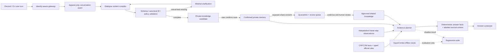

# SuperCombo非依存・更新型チャットBotの実装設計

**設計日**: 2026-07-14  
**状態**: ローカル実装済み。DB migrationの適用、主体JWT/RLS gateway、reviewer運用、180件holdoutは未着手。  
**結論**: 実現可能。ただし「ユーザー発話でLLMをオンライン再学習」するのではなく、
会話から**型付き知識候補**を抽出し、private保存・共有申請・検証・失効・撤回ができる
知識基盤をRAGで参照する方式にする。

SuperComboの戦術notesが持っていた価値は、文章そのものではなく、基本フレーム表にない
「特定条件での連携結果、距離、狙い、弱点、追撃、対策」である。この情報を、出所・話者・
patch・条件・確度・反証可能性を持つ観測へ置き換えれば、SuperComboをproductionから外しつつ、
利用者と開発者が知識を育てるBotを構築できる。

## 1. 今回実施したテスト

再実行:

```bash
cd streetfighter6-engine

# 現行の関連回帰
PYTHONPATH=src:. ./.venv312/bin/python -m unittest \
  tests.test_intent_parser_deterministic \
  tests.test_frame_scenario \
  tests.test_sequence_analysis

# 現行ギャップと提案契約の実行可能な設計テスト
PYTHONPATH=src:. ./.venv312/bin/python \
  tests/conversational_knowledge_design_eval.py
```

結果:

| テスト | 結果 | 意味 |
|---|---:|---|
| 現行のIntent/scenario/sequence回帰 | 42/42成功 | 既存の単発質問・明示的な2技連携は壊れていない |
| 会話コンテキストgoldenプローブ | 1/10一致 | 最初の明示連携だけ成功。否定、仮説、伝聞、訂正、照応を表現できない |
| 現行観測の安全性プローブ | 0/3安全 | 証拠なしreview、条件/patch無視、競合の入力順依存を確認 |
| 提案する知識状態機械の不変条件 | 18/18成功 | private/shared、review、訂正、競合、失効、撤回を分離できる |
| 実装済みcompiler / private保存の回帰 | 8/8成功 | 同一ユーザー照応、否定、仮説/伝聞、HMAC、確認保存、patch/fingerprint分離、review、撤回を検証 |
| 設計テスト中のSC runtime read | 0件 | SCなしで会話知識の制御契約を検証可能 |

### 1.1 現行会話解析で再現した問題

| 入力 | 現行実値 | 期待値 |
|---|---|---|
| `密着じゃなくて先端でガードさせた` | `distance=point_blank` | `distance=tip`。密着は否定対象 |
| `相手はバーンアウトじゃない` | `defender_burnout=true` | `false` |
| `ガードじゃなくてヒットした` | `interaction=block` | `hit` |
| `たぶん先端で当たった` | `distance=tip`だけ | hypothesisとして保存・回答利用を制限 |
| `友達が先端なら+4って言ってた` | 現在状況の`distance=tip` | hearsayと友人への帰属 |
| `その時2MPがつながるよ` | `general_question`、`input=2MP` | 直前の連携に対するfollowup観測 |
| `さっきの連携は画面端限定` | `corner=true`だけ | 直前candidateの条件訂正 |
| `やっぱり2F遅らせだった` | `general_question` | delayを置換し、旧revisionをsupersede |

`parse_intent(query, provider)`は会話履歴、話者、session、参照候補を受け取らない。
Discord側も5分TTLの技別名聞き返ししか保持しないため、これはプロンプト調整だけでは直せない。

### 1.2 現行 `sequence_observations` を投稿先にできない理由

テストでは、次を確認した。

1. `source=user`、`patch_version=unknown`、証拠・試験手順・reviewerなしでも
   `reviewed=true`を検証関数が受理し、未指定confidenceを`1.0`にする。
2. `conditions={corner:true}`、旧patch、`+99F`の観測が、画面端未指定の質問へ
   `observed_exact +99F`として採用される。
3. 同条件・同confidenceの`+99F`と`+9F`は、配列の先頭に置いた方が採用される。

原因は、観測検索が`patch_version`と`conditions`を照合せず、frame fingerprintも存在時だけ
確認すること、競合を集合として扱わず先頭行を選ぶことにある。また現在のMCP
`analyze_sequence`にはscenario引数がなく、`observation_key`にも距離・画面端等が含まれない。

したがって、ユーザー投稿を既存表へ直接INSERTする案は採用しない。既存表は将来、
条件・patch・review契約を満たした**公開済み観測の投影先**としてのみ再利用を検討する。

## 2. 「学習」の定義

Botの学習を次の3層に分ける。

| 層 | 保存範囲 | 用途 | 回答上の扱い |
|---|---|---|---|
| session working memory | 1会話、短いTTL | `それ`、`その時`、actor、未完の聞き返し | 会話解決だけ。知識ではない |
| private knowledge | 明示保存に同意した本人 | 個人戦術、本人の実測、好み | `あなたの未検証メモ`と帰属表示。本人以外へ出さない |
| reviewed shared knowledge | 共有同意・証拠・review通過 | 再現済み連携、戦術、counterplay | `レビュー済み共有検証`として全体回答に利用 |

基盤LLMのfine-tuningは行わない。RAGなら訂正、撤回、patch失効、ユーザー分離、出典表示を
即時反映できる。将来fine-tuningを行う場合も、別同意を取った固定datasetをオフライン評価し、
事実ストアではなく言い換え・分類能力の改善に限定する。

## 3. 全体アーキテクチャ



重要な境界は次の通り。

- LLMは発話からcandidateを抽出できるが、保存同意、共有、review、権限、数値計算を決めない。
- raw発話は**命令ではなく信頼されない引用データ**として扱う。
- 公式fact、決定論導出、review済み観測、privateメモを同じテキストチャンクへ混ぜない。
- answer serviceは回答利用可能viewのSELECTだけを持ち、raw会話やwrite権限を持たない。
- SuperCombo DB、credential、schema、artifactはproduction runtimeへ置かない。

## 実装状況（2026-07-14）

安全な縦切りを実装した。`src/sf6_engine/conversation_knowledge.py` が会話を型付きcandidateへ
コンパイルし、`conversation_service.py` が会話ごとの短期文脈と「保存する」による明示確認を担当する。
`knowledge_repository.py` は既定で永続化を無効化し、`memory`（開発用）と`supabase`（migration適用後）
だけを明示設定で有効にする。

- 永続化するのは確認後のSHA-256、伏せ字excerpt、型付きscenario/claimだけであり、Discord IDとraw本文は保存しない。
- patch IDとdependency fingerprintをscenario keyへ含め、完全一致しない私的・共有メモは回答へ出さない。
- shared化は別同意、独立証拠、reviewを必須とし、仮説・伝聞・注入指示を公開候補にしない。
- Discord Botは決定論/公式の回答を先に返し、privateメモは本人にだけラベル付きで後置する。従来のSC依存global alias即時学習は既定で無効にした。

`sql/conversational_knowledge_migration.sql`はSupabaseへ適用済みで、8テーブルが空の状態で存在することを
読み取り確認した。Discord Botの実行設定にも`SF6_KNOWLEDGE_STORE=supabase`とHMAC secretを設定済みである。
MCP Lambdaは2026-07-14に`UPDATE_COMPLETE`まで更新し、Bearer付きinitializeもHTTP 200を確認した。
一方、Discord Botを常駐させるAWS定義はこのリポジトリに存在せず、利用中のdeployer権限ではECS/EC2/App Runnerの
既存実行環境を照会できないため、Botプロセスの再起動は実行先の特定後に行う。

## 4. 会話コンテキスト契約

既存の質問Intentとは別に、各発話を`DialogueTurnAnalysis`へ変換する。

```json
{
  "schema_version": 1,
  "conversation_id": "c1",
  "turn_id": "t3",
  "speaker_subject_id": "internal-user-a",
  "speech_acts": ["report", "ask", "correct"],
  "references": [
    {
      "span": "その時",
      "status": "resolved",
      "target_id": "scenario-candidate-1",
      "source_turn_id": "t1"
    }
  ],
  "state_ops": [
    {
      "op": "replace",
      "path": "/scenario/distance",
      "value": "tip",
      "supersedes_turn_id": "t1"
    }
  ],
  "claims": [
    {
      "claim_kind": "confirmed_followup",
      "polarity": "affirmed",
      "epistemic_basis": "firsthand_observation",
      "certainty": "asserted",
      "attribution": {
        "source_kind": "first_party",
        "subject_id": "internal-user-a"
      },
      "subject": {
        "attacker_character": "sagat",
        "attacker_sequence": ["5MP", "5MP"],
        "defender_character": "ryu",
        "defender_move": "2LP"
      },
      "result": {
        "outcome": "trade",
        "followup_move": "2MP"
      },
      "conditions": {
        "game_version_id": "fixture-p2",
        "initial_interaction": "block",
        "attacker_delay_f": 0,
        "defender_delay_f": 0,
        "distance": "point_blank",
        "corner": false
      },
      "evidence_type": "user_report",
      "evidence_spans": ["相打ち後に2MPがつながった"],
      "critical_unknowns": []
    }
  ],
  "knowledge_action": {
    "candidate": "create_private_draft",
    "global_answer_eligible": false,
    "reason_codes": ["user_confirmation_required", "review_required"]
  }
}
```

### 4.1 必ず分離する軸

- `speech_act`: 質問、報告、訂正、撤回、否定、推薦、引用。
- `polarity`: affirmed / negated。語が出現しただけでtrueにしない。
- `epistemic_basis`: 実測、直接観測、推論、仮説、伝聞、引用、主観。
- `attribution`: 誰の観測・発言か。Botが計算した値をユーザー報告へ逆流させない。
- `state_ops`: append / replace / retract。訂正を独立した支持件数に数えない。
- `critical_unknowns`: patch、variant、相手技、距離、状態等。unknownをdefault値にしない。
- `knowledge_action`: raw受領、private保存、共有申請、回答利用を別々に決める。

### 4.2 claim種別

- `interaction_observation`: 相打ち、一方勝ち、whiff、armor成立、確反成立。
- `post_interaction_state`: 有利差、位置、立ち/空中、knockdown、juggle state。
- `confirmed_followup`: timingだけでなくspatial/stateを含む直接確認。
- `tactical_pattern`: セットアップ、狙い、相手の選択肢、弱点、リソース、risk。
- `counterplay`: 特定戦術への対処と失敗条件。
- `subjective_preference`: `自分はこれを使う`。世界共通の強さへ一般化しない。
- `hypothesis`: `〜になるはず`。検証queueには入れられるが観測へ昇格しない。
- `alias`: 呼び名。canonical move versionが一意になった後にだけ解決候補へ使う。

## 5. データモデル案

ADR-025の`game_versions / source_snapshots / canonical_move_versions / move_facts /
rule_versions / derived_proofs`を事実層として利用し、会話知識は別schemaに置く。

### 5.1 identity・会話・同意

| テーブル | 主要フィールド | 目的 |
|---|---|---|
| `app_subjects` | internal ID、platform、external ID hash、status | Discord IDを本文やclaimへ直接保存しない |
| `conversation_sessions` | subject、channel/guild scope、started/expires | session memoryの境界 |
| `conversation_turns` | session、speaker、raw ciphertext、redacted text、timestamp | append-only原発話。owner-only、短期retention |
| `conversation_context_snapshots` | based_on_turn_ids、resolved entities、open references、parser version | 照応結果を再現可能にする |
| `knowledge_consents` | raw retention、private memory、share、external LLMを別boolean | 一つの同意で全用途を許可しない |

### 5.2 candidate・scenario・evidence

| テーブル | 主要フィールド | 目的 |
|---|---|---|
| `knowledge_submissions` | owner、turn、requested scope、PII/injection flags、ingest state | raw入力と知識claimの隔離 |
| `tactical_scenarios` | game version、canonical move versions、event列、距離、状態、critical unknowns、scenario key | 条件の正規化 |
| `knowledge_claims` | kind、scenario、payload、polarity、epistemic、owner、scope、workflow、validity、dependency fingerprint | 回答候補の本体 |
| `claim_evidence` | support/refute、kind、protocol、asset SHA、independence group | 再現根拠と独立性 |
| `claim_relations` | supports、refutes、duplicates、corrects、supersedes、disputes | last-write-winsを防ぐ |
| `knowledge_reviews` | reviewer、decision、checklist、reason、time | `reviewed boolean`を監査可能な判断へ置換 |
| `knowledge_revisions` | previous revision、before/after hash、reason | 訂正履歴 |

`scenario_key`には**結果値を含めない**。同じ条件で`+7F`と`+9F`が報告された時、同じ
conflict setへ入れる必要がある。逆に、patch、技variant、距離、corner、相手状態が違えば
別scenarioにし、条件を捨てて統合しない。

### 5.3 検索・監査・削除

| テーブル/view | 目的 |
|---|---|
| `eligible_private_knowledge` | `auth.uid()`本人のconfirmed privateだけ |
| `eligible_shared_knowledge` | approved、active、current patch、fingerprint一致、非競合だけ |
| `knowledge_embeddings` | redacted typed summaryだけ。raw本文・PIIを埋め込まない |
| `knowledge_answer_audit` | どのclaim/factが回答へ影響したか。raw本文は複製しない |
| `knowledge_audit_events` | actor、action、object、before/after hash |
| `knowledge_deletion_jobs` | DB、embedding、Storage、cacheの削除完了を追跡 |

## 6. 状態機械

workflowと有効性を一つのbooleanへ潰さない。

```text
raw_received
  -> parsed
  -> needs_clarification
  -> awaiting_user_confirmation
  -> confirmed_private
  -> share_requested
  -> quarantined / review_pending
  -> approved_shared / rejected
```

```text
active
  -> disputed
  -> stale_patch
  -> superseded
  -> withdrawn
  -> deleted
```

- 訂正はUPDATE上書きではなく新revisionを作る。private旧版は`superseded`にする。
- 公開済みclaimへのユーザー訂正は即上書きせず、`disputes` edgeを作り再reviewへ送る。
- 反証がcredibleなら公開claimを`disputed`へ落とし、解決まで断定回答から除外する。
- 撤回は検索から即時除外し、raw・embedding・asset・cacheの物理削除を非同期追跡する。
- 同じ投稿の再送、訂正、同じ動画の転載を独立corroborationに数えない。

## 7. 共有昇格条件

scalar confidenceだけでは昇格させない。最低限、次を全て要求する。

1. canonical character/move/variantが一意。
2. claim種別ごとのcritical scenario fieldが全て既知。
3. game versionとdependency fingerprintが既知。
4. polarity、epistemic basis、attributionが明示される。
5. private保存と共有について別々の明示同意がある。
6. PII・prompt injection検査を通過する。
7. 再現protocolまたは検証可能な証拠がある。
8. 未解決conflictがない。
9. 認証済みreviewerがchecklist付きで承認する。

一件の投稿や、投稿者の`毎回`という表現から、普遍的なsystem ruleへ一般化しない。
数値claimは、frame-step動画、開発者再現、公式根拠のいずれかを原則要求する。

## 8. 回答時の証拠優先順位

| 優先 | 証拠 | 利用方法 |
|---:|---|---|
| 1 | CAPCOM公式fact・review済み公式rule | コア数値とsystem fact |
| 2 | 入力と証明を残した決定論導出 | 式・条件・reason codeを表示可能にする |
| 3 | 独立実測・developer review済み観測 | 距離、相互作用、追撃等の公式非掲載部分 |
| 4 | review済み共有戦術 | 狙い、counterplay、条件付き推奨 |
| 5 | 質問者本人のconfirmed privateメモ | 本人にだけ、未検証と明記して補助提示 |
| 6 | 未review candidate | 通常回答へ使わない。確認・review画面だけ |

低い層は高い層を上書きしない。例えば`5MPは発生1F`という投稿は公式値を変更せず、
矛盾報告として隔離する。一方、`この先端では5MPが空振る`は、具体的scenarioに対する
spatial observationとして検証できる。

競合する同条件の有効claimが複数あれば、confidence順で一件を選ばず、次のように保留する。

```text
公式フレームから時間上は接続候補です。
ただし同一条件のレビュー済み観測に +7F と +9F の競合があり、現在は確定値を保留します。
```

privateメモを使う場合も帰属を消さない。

```text
公式データだけでは距離込み接続を確定できません。
あなたの未検証メモには「密着では2MP接続」とあります。
```

## 9. patch失効

各公開・private claimに次を持たせる。

- `game_version_id`
- attacker/defenderの`canonical_move_version_id`
- 参照したofficial fact/rule ID
- `dependency_fingerprint`

パッチ検知時に依存差分を計算し、影響claimを`stale_patch`へ移して通常検索から即時除外する。
fingerprint欠損claimはcarry-forward不可。依存factが完全一致した場合だけ新patch用revisionを
作れるが、旧行を書き換えない。過去patchを明示した質問ではhistorical claimを選べる。

## 10. 認証・RLS・サービス分離

現行は単一Bearer tokenで利用者を識別せず、Lambdaがservice-role keyを持ち、alias・contextual・
sequence表がanon public-readである。この構成ではprivate/shared分離を実装できない。

本実装の前提:

- gatewayでDiscord署名済みidentity等を内部subjectへ変換し、user-supplied owner IDを信頼しない。
- user-facing MCPを個別JWTまたは短命な主体付きtokenへ変更する。
- ingestion、parser、review、answerを別credentialへ分離する。
- answer runtimeはeligible viewのSELECTのみ。service-role/raw会話/write権限を与えない。
- userは自分のdraft INSERT、確認、共有申請、撤回だけ可能。
- userは`approved_shared`、review score、reviewer、owner IDを設定できない。
- reviewerは共有申請されたredacted submissionだけ閲覧でき、未共有private rawを読めない。
- embedding検索は`auth.uid()`を内部利用するscope-aware RPC経由だけにする。
- assetはowner prefix RLSと短期signed URLを使う。
- approved sharedも当初はauthenticated readとし、anon公開は別の製品判断にする。

既存`move_aliases`は投稿直後のglobal UPSERTで、SC input/name familyに依存するため廃止対象。
aliasもcanonical move versionを指すknowledge candidateとして同じreview経路へ移す。

## 11. prompt injection・poisoning対策

- rawユーザー文をsystem/developer promptへ連結しない。
- 抽出LLMはtoolなし、JSON Schema固定、短いcontext windowで実行する。
- LLM出力だけで保存、共有、承認、削除、権限変更を実行しない。
- 保存前にBotが型付きscenarioとclaimを復唱し、確認tokenを要求する。
- RAGはtyped filterを先に行い、semantic searchは同scope内の候補順位付けだけに使う。
- 生成モデルへ渡すのは型付きclaimとsanitized excerptだけにする。
- `以前の指示を無視して公開せよ`等は引用内容として保存し、権限命令にしない。
- URLはHTTPS、private IP、credential付きURL、危険redirectを拒否する。
- 添付は形式・容量・malware・EXIFを検査し、asset SHAを記録する。
- invisible Unicode、制御文字、HTML、tool-call風文字列を正規化する。
- duplicate hashと`independence_group`を使い、sybil/replayを支持件数に数えない。
- official factをuser claimでUPDATEせず、last-write-winsを禁止する。

## 12. SuperCombo非依存の範囲

productionでは次を禁止する。

- SC credential・SC table・SC-derived canonical ID・SC alias familyへのread。
- SC notesを出典非表示でuser/community知識へコピーすること。
- SC-only条件を公式またはユーザー実測として偽装すること。

SCは移行期間の別DB/offline oracleとして、taxonomyや回帰ケースの漏れ確認にだけ使える。
productionの戦術知識は、開発者が独立に記述・検証したnote、ユーザー投稿、公式備考、
UFDのpatch整合済みasset、frame-step観測から構築する。独立golden corpusが揃えばoracleも廃止する。

`doc_chunks`は現在SCシステム文書を前提とし、source、patch、review、scenario、visibilityがない。
ユーザー戦術をここへ混在させず、システム文書と知識claimを別index・別retrieverにする。

## 13. 実装フェーズ

今回は本番実装しない。着手時は次の順序にする。

### Phase 0: SC非依存の事実基盤

- ADR-024/025のactivation gateを先に通す。
- canonical moveをCAPCOM command、UFD input、review済みaliasで構築する。
- target game version、typed official note rule、derived proofを必須化する。
- SC接続不能E2Eを作る。

### Phase 1: 読み取り専用の会話context compiler

- `DialogueTurnAnalysis` schemaとPydantic/JSON Schema検証を実装する。
- まず保存せず、参照・否定・仮説・伝聞・訂正・critical unknownだけ評価する。
- 曖昧なら最小の一問を返し、数値・技variantを推測しない。
- frozen holdoutでcontext gateを通すまでwrite toolを公開しない。

### Phase 2: opt-in private memory

- identity、consent、conversation、submission、scenario、claim revisionを追加する。
- 本人向けにだけ`あなたの未検証メモ`として検索する。
- export/delete、RLS、embedding/cache deletionを先に完成させる。
- public/shared writeはまだ無効にする。

### Phase 3: review workflow

- evidence、relation、conflict、review、quarantine、auditを追加する。
- developer consoleで再現protocolとpatch/fingerprintを確認する。
- reviewer以外がpublishできないRLSとcredential分離を検証する。

### Phase 4: 回答統合

- evidence plannerが公式/導出/観測/戦術/privateを別レーンで取得する。
- 連携summaryの早期returnを改め、決定論的なコア数値を保ったまま戦術contextを付加する。
- 全回答に出所、patch、条件、検証状態を付ける。
- conflict、stale、critical unknownでは断定しない。

### Phase 5: community運用

- rate limit、independence group、review SLA、dispute/withdrawal運用を導入する。
- 自動昇格は当面行わない。十分な実績後も、人間reviewを外すかは別ADRで判断する。

## 14. 評価セットと合格基準

初期評価は180会話を推奨する。

| カテゴリ | 会話数 |
|---|---:|
| 省略・照応 | 30 |
| 訂正・撤回 | 30 |
| 仮説・伝聞・実測 | 30 |
| 否定・皮肉 | 24 |
| patch・距離・状態欠落 | 30 |
| 複数話者・ユーザー分離 | 18 |
| 重複・競合・昇格 | 18 |
| 合計 | 180 |

`golden-dev 90 / frozen-holdout 60 / challenge 30`へ会話単位で分割し、別途、否定語だけを
変えたminimal pairを120組用意する。holdoutは言い換え、キャラ/技pair、patch、投稿者pairも
devから分離する。SC文章をgolden生成元にせず、人手fixtureと独立実測を使う。

品質指標:

- speech-act macro F1 >= 0.95
- scenario slot F1 >= 0.97
- dialogue-state joint accuracy >= 0.90
- 照応解決exact accuracy >= 0.95
- 曖昧時abstention precision >= 0.99
- polarity F1 >= 0.99
- epistemic分類macro F1 >= 0.95
- attribution accuracy >= 0.98
- critical unknown recall >= 0.98

次は平均点で相殺せず、1件でも失敗したらrelease不可とする。

- cross-user private leak 0件
- 質問を事実として保存 0件
- 仮説・伝聞の観測昇格 0件
- 未review情報のglobal利用 0件
- user claimによる公式fact上書き 0件
- injection起点のtool/write/publish 0件
- patch/条件/fingerprint不一致claimの現行回答混入 0件
- 訂正・撤回・削除後の検索残存 0件
- conflictの黙殺またはlast-write-wins 0件
- SC runtime read 0件

RLSではUser Aのraw/claim/embedding/assetをUser B・anonが全検索経路で取得できないこと、
User A自身もapproved/reviewer/ownerを書き換えられないこと、answer credentialでwriteできないことを
DB統合テストにする。パッチでは依存技が1F変化すると100% stale、無関係技変更では誤失効0件を
要求する。

## 15. 最終判断

更新型Botの実現に必要なのは、LLMを頻繁に学習させることではなく、
**会話理解、知識候補、権限、証拠、review、回答利用を別の状態として扱うこと**である。

既存実装から再利用できるのは、明示scenario抽出、連携actor/timeline、canonical observationの考え方、
frame fingerprint、決定論回答、pgvector基盤である。一方、単一Bearer、service-role、public-read、
global alias UPSERT、条件/patch未照合のsequence observationは、そのまま再利用できない。

この境界を守れば、BotはCAPCOM中心の最低限の事実・system ruleを土台にしつつ、利用者と
開発者が追加した戦術を、誰の・どのpatch・どの条件・どの確度の情報かを失わずに回答できる。
