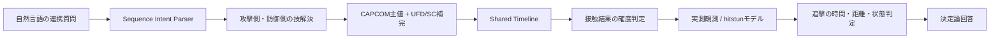

# 連携・相打ち・追撃解析の設計

## 目的

単発技のフレーム表を読み上げるだけでなく、「5MP→5MPに最速4F暴れ」のような
複数の行動を共通タイムラインで評価する。時間、距離、状態、実測を分離し、根拠より
強い結論を返さない。



## ソース方針

| 値 | 採用方針 |
|---|---|
| 発生・持続・硬直・ヒット/ガード差 | 既存の統合プロファイル。CAPCOM公式を主値、UFDとSCを補完に使う |
| `hitstun` / `blockstun` / `hitstop` | SuperComboの生値。統合値へ上書きせず補助根拠として保持 |
| リーチ・技解説 | SC `atk_range` / notes。単体リーチだけで接触確定にしない |
| 当たり判定GIF | UFD private Storage資産。座標校正済みgeometryへ変換後のみ計算に利用 |
| 相打ち結果・追撃 | 相手キャラ+技まで一致するレビュー済み `sequence_observations`を最優先。無ければラベル付きモデル |

SuperComboのアクセス制限を回避するクローラは実装しない。利用条件に従って人手で取得した
JSON/HTMLスナップショットを既存インポーターで取り込み、取得日・パッチ・根拠を残す。

## 自然言語からの技分解

Intent Parserの責務は、`→ / > / から / の後に / AをBでキャンセル / into` の境界で
2技を分け、`2中K`や`立ち弱P`の汎用入力表記だけを正規化することである。キャラ固有の
必殺技名・SA名・派生名は変換表を持たず、不透明な識別子として`lookup_frame_data`へ渡す。

resolverはCAPCOM/UFD/SuperCombo/必殺技マッピングを同じキャラ内で検索する。誤記補正は、
強度/SA prefixを保存した上で一候補が明確に優位な場合だけ実行する。同名の弱中強や派生が
残る場合は、自動選択せず強度・コマンドの聞き返しを返す。

## 質問コンテキストの分離

2技連携には、同じ「ガード」でも別の時点を指す値がある。

| 構造化フィールド | 意味 | 使用する値 |
|---|---|---|
| `initial_interaction` | 1技目がガード/ヒットされた状態。2技目をいつ開始できるかを決める | 1技目のblockstun/hitstun、cancel/chain/link遷移 |
| `terminal_state.interaction` | 2技目が実際にガード/ヒットした後の状態 | 2技目の`on_block`/`on_hit` |
| `query_targets=timeline` | 1技目と2技目の間が連続ガードか、何F空くか | 2技目first active − 防御側行動可能F |
| `query_targets=terminal_frame_advantage` | 2技目の接触後にどちらが何F有利か | 攻撃側=`on_block/on_hit`、防御側=符号反転 |
| `query_targets=post_interaction_advantage` | 相打ちなど、両技が接触した後の派生結果 | 実測観測またはhitstun差モデル |

例えば「5LP→弱波掌撃をガードして何F有利？」は、2技目のガード後硬直差を主質問として
`terminal_frame_advantage`へ送り、技間gapは補足にする。「ガードして」の主体が省略された場合は
攻撃側・ガード側の両方を返し、明示された場合はその視点を優先する。

## タイムライン

> この節の式は、1技目を出し切ってから2技目を出す `link` 用である。通常技から必殺技への
> special/SA/連打cancel、chain、専用派生には適用しない。連続ガード・割り込み解析の遷移モデルは
> `docs/BLOCKSTRING_ANALYSIS.md` を参照する。

現在は攻撃側2技、1技目のblock/hit、2技目と防御側行動の遅延Fを扱う。

```text
attacker_ready = max(0, -initial_advantage)
defender_ready = max(0,  initial_advantage)
attacker_active = attacker_ready + attacker_delay + second_move_startup
defender_active = defender_ready + defender_delay + defender_move_startup
```

両者のactive開始が同じなら「フレーム上は同時」である。それだけで相打ちとは断定せず、
両方が届くこと、無敵・アーマー・飛び道具などの特殊相互作用がないことを別に要求する。
数値のない「ディレイ」は0Fへ潰さず、フレーム数を確認する。

## 相打ち後の結果

優先順位は次の通り。

1. 相手キャラ+技、現在のフレーム指紋、条件がすべて一致するレビュー済み観測
2. 相手技が特定済みの `hitstun` 差モデル
3. 「発生4F技」のように相手技が未特定なら、該当技を1件ずつ計算した分布と最小・最大区間
4. 必要値が無ければ未解決

同時の直接打撃に限る現モデルは次式を使う。

```text
attacker_advantage = attacker_inflicted_hitstun
                   - defender_inflicted_hitstun
                   - 1
```

共通のhitstopは差へ加算せず、生値は証拠に残す。この式は `calculation_model` と明記し、
実測値と同じ確度で表示しない。

発生Fは相打ちする時点を決める値であり、相打ち後の有利差を一意には決めない。同じ4F技でも
相手へ与えるhitstunが異なるため、相手技未指定時に代表値を選んではならない。

## 追撃の保証レベル

| フィールド | 意味 |
|---|---|
| `timing_connected` | 発生Fが有利差以内 |
| `spatial_connected` | 実測または校正済みgeometryで届く |
| `state_connected` | 立ち/しゃがみ/空中・juggle等の状態が適合 |
| `combo_confirmed` | 上記を直接実測で確認済み |

発生が間に合うだけの技は「フレーム上の追撃候補」とし、連続ヒット確定とは呼ばない。

## サガットの検証ケース

`5MP→5MP / ガード後 / 最速4F暴れ / 相打ち` は次の根拠で返す。

- 1発目のガード差は攻撃側 `+2F`（CAPCOM公式採用値）
- 2発目は発生 `6F`、防御側は2F遅れて発生4F技を開始するため両方とも共通6F目
- SC実データの地上4F通常技46件はhitstunが異なり、技別計算はサガット側 `+6～+12F`
- 例: `Ryu 2LP`はhitstun 15Fなので `25 - 15 - 1 = +9F`
- 例: `Sagat 2LP`はhitstun 17Fなので `25 - 17 - 1 = +7F`
- `2MP`は発生7Fなので時間上44/46技で接続するが、+6Fになる2技には接続しない
- 距離・接触状態を未検証のため、上記の時間候補をそのまま確認済みコンボとは呼ばない

## 永続化

`sql/sequence_analysis_migration.sql` を `contextual_frame_model_migration.sql` の後に適用する。

```bash
# SQL適用前のJSON検証
PYTHONPATH=src ./.venv312/bin/python -m \
  sf6_engine.importers.sequence_observations --dry-run

# SQL適用後に観測をupsert
PYTHONPATH=src ./.venv312/bin/python -m \
  sf6_engine.importers.sequence_observations
```

DB移行中でもLambda/Botを壊さないよう、観測JSONローダーを同梱する。現在の初期行は、過去に
報告された`+7F / 2MP`について相手技IDが記録されていないため、`reviewed=false`かつ
`usable_for_exact_answer=false`の不完全証拠としてのみ保存する。数値または確認済み追撃を持つ
レビュー済み観測には、相手キャラと技入力の両方を必須とする。観測keyにもこの2項目を含める。

## 現在の境界

対応済み:

- 2技のblock/hit連携、攻撃側・防御側それぞれの遅延
- SuperComboでSpecial cancelが明示された最速の通常技→必殺技。blockstun/hitstunとhitstop終了後を
  基準に、連続ガード・時間上の割り込み可否を返す
- 相手を発生Fだけで指定した区間結果と、キャラ+技指定の個別結果
- 同時発生、相手技別SC hitstun差モデル、追撃の確度分離
- Intent、CLI/RAG、MCP、Discord Botの共通エンジン化
- 2技目のガード/ヒット後硬直差と技間gapの分離。質問された終端硬直差を先に回答し、
  攻撃側・防御側の視点を明示する
- AWS MCP Lambdaへの反映と、ローカルフォールバック無効の本番E2E検証

未対応:

- 3技以上のシーケンス、移動・ジャンプ・飛び道具のイベント
- armor/invulnerability/throw/projectileの衝突解決
- UFD GIFの自動geometry抽出とpushbox/カメラ補正
- 任意cancel窓、juggle、空中高度を含む全追撃の確定
- 全キャラ・全技組合せの直接実測

現行の `on_block + startup` timelineをcancel連携へ流用してはならない。cancelでは1技目の
recoveryが打ち切られるため、blockstun、cancel可否、transition開始基準、2技目startupを使う。
不足時はlinkとして推測せず `transition_unresolved` を返す。
