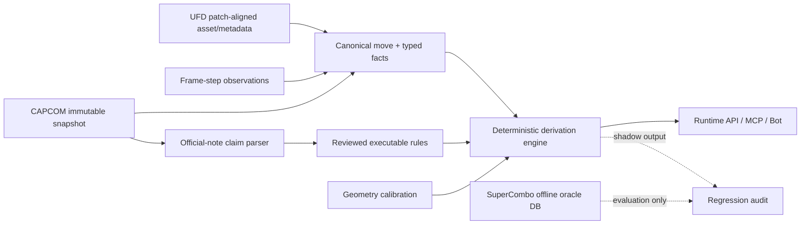

# CAPCOM備考・UFD文脈によるSuperCombo不一致の再監査

**実施日**: 2026-07-14  
**対象**: 全30キャラ、CAPCOM 2,357行、UFD 1,559行、SuperCombo 2,118行  
**結論**: SuperComboに依存しない**本番ランタイム**は設計できる。ただし、SuperComboの
全フィールドをCAPCOM/UFDから完全復元できるわけではない。公式備考で明記された条件は
型付きルールへ変換し、欠ける距離・juggle数値・弾速・接触状態はgeometryまたは独立実測へ
分離し、証拠がない場合は推測せず `unresolved` を返す必要がある。

## 1. 今回分けて検証した問い

1. CAPCOM公式の `備考` と `属性` は、無敵・armor・空中判定・飛び道具・条件別硬直を
   どこまで構造化できるか。
2. 基本地上通常技360件で、CAPCOMから計算した `hitstun / blockstun / total` が
   SuperComboと一致しない31セル・24技の直接原因は何か。
3. 距離、無敵、armor、飛び道具、juggle、空中状態、戦術notesは不一致の原因か、または
   接触成立・結果状態を選ぶ条件か。
4. SuperComboを本番から切り離した場合に、どのデータモデルと検証ゲートが必要か。

SuperComboは比較ラベルにだけ使用した。基本地上通常技360件の対応付けは
`立ち中P -> 5MP` など固定名称変換だけで行い、SCのフレーム値やnotesを入力へ使っていない。
特殊技・必殺技を含む1,429行のメタデータ比較は、既存 `special_move_map` がSC-assistedであるため、
独立推論の成績ではなく、公式記載のカバレッジ監査としてのみ扱う。

また、現在のsnapshotはCAPCOMの大半が2026-05-28 patch、SCは2026-04-26取得JSONを
2026-05-15にimport、UFDは2026-07-10取得で揃っていない。不一致をゲーム内例外と断定せず、
同一patchで再確認するまでsource-version候補を残す。

再実行:

```bash
cd streetfighter6-engine
PYTHONPATH=src ./.venv312/bin/python \
  tests/supercombo_context_audit.py \
  --output /tmp/supercombo_context_results.json
```

## 2. CAPCOM公式備考・属性は十分に使える

全2,357行のうち、備考ありは1,781行（75.56%）、属性ありは2,032行（86.21%）。
備考は903種類あり、1,104行が複数行の説明だった。単純な飾り文ではなく、次のような
実行候補ルールが含まれる。

現行scraperは既に `frame_note -> note` と `frame_attribute -> attribute` を保存している。
ただしruntimeの `frame_data.py` はCAPCOM `note` を表示用に読むだけで、`attribute` をselectせず、
どちらも型付き条件としては使っていない。新たな取得元を増やす前に、既存の公式列を
`fact/claim` へ構造化する余地が大きい。

```text
空振り時硬直2F増加
1-15F 投げ無敵
6-16F 空中判定の打撃・空弾属性に対して無敵
1-27F アーマー判定（2回）
キャンセルは持続の1F目がヒットした時のみ
```

狭い決定論grammarで `N F増加/減少` まで抽出できた結果別硬直は197行・209 claimだった。
内訳はhit 97、block 32、whiff 98。キーワード候補の全件数は次の通りである。

| 公式備考・属性の概念 | 該当行 |
|---|---:|
| 無敵 | 453 |
| 飛び道具・弾属性・相殺 | 284 |
| 自身の空中状態／空中判定 | 272 |
| armor状態 | 67 |
| armor break | 10 |
| 追撃・空中ヒット結果 | 295 |
| 条件別硬直候補 | 685 |
| 距離・密着・先端 | 14 |

ここで「該当」は字句候補であり、そのまま実行可能なruleではない。例えば
`アーマーヒット時硬直3F増加` は技自身がarmorを持つという意味ではなく、armorへ当てた結果の
説明である。原文span、対象actor、条件、frame windowを分離してから有効化する必要がある。

### SuperComboを比較ラベルにした記載カバレッジ

| 項目 | CAPCOM記載の適合率 | 再現率 | 分かったこと |
|---|---:|---:|---|
| 無敵any | 94.6% | 74.3% | 閉区間を記載した263件のうち240件（91.3%）はSCと少なくとも1区間一致 |
| 自身の空中判定 | 100% | 71.1% | 記載区間212件中165件（77.8%）が一致 |
| 実armor候補（actor未解決） | 64.7% | 88.0% | 派生先・armorへヒット等の主語誤認を除く型付きparserが必要 |
| SCに`proj_speed`がある行（属性`弾`） | 72.7% | 97.4% | 飛び道具のproxyとして高coverage、弾速数値の公式記載は0件 |
| cancelの存在 | 96.8% | 88.8% | CAPCOM中心へ移しやすい |
| SC `atk_range` | 54.6% | 0.55% | 公式表だけから数値距離はほぼ復元不能 |
| 非default juggle tuple | 71.8% | 13.7% | 空中結果語はあるがjuggle数値の公式記載は0件 |

無敵は「記載があれば高精度、未記載が主な欠損」という形だった。特にFull/Strike/Throw系は
よく一致する一方、上半身・下半身の飛び道具無敵などはSCにしかない例があり、Projectile無敵の
再現率は32.5%に留まった。`armor=Break` はarmorを持つ状態ではなくarmor-breaking capabilityで、
別フィールドにしなければならない。

したがって、CAPCOM備考は有力な一次情報である。ただし、距離、弾速、juggle数値、全ての
状態区間を網羅するデータではない。

### 集計定義・regex・分母

上表は行単位の二値比較で、`precision = TP / (TP + FP)`、
`recall = TP / (TP + FN)` とした。母集団はCAPCOM備考がある行だけではなく、対応付けできた
全1,429行である。SCラベルもCAPCOM候補もない行はTNとして残した。

対応方法の内訳は固定名称546、`auto-sig3` 564、manual 104、`auto-loose` 122、
`auto-sig2` 93。後二者を除く固定名称・manual・`auto-sig3`の1,214行も感度分析した。
ただし、必殺技等の `special_move_map` は元々SC-assistedであり、どちらの母集団も
「技同定を含む完全な独立精度」ではなく、対応済み行における記載coverageである。

| 指標 | SC positive | CAPCOM positive | TP | FP | FN | 適合率 | 再現率 |
|---|---:|---:|---:|---:|---:|---:|---:|
| 無敵any | 354 | 278 | 263 | 15 | 91 | 94.6% | 74.3% |
| 自身の空中判定 | 305 | 217 | 217 | 0 | 88 | 100% | 71.1% |
| 実armor候補 | 25 | 34 | 22 | 12 | 3 | 64.7% | 88.0% |
| `proj_speed`あり | 115 | 154 | 112 | 42 | 3 | 72.7% | 97.4% |
| cancelあり | 753 | 691 | 669 | 22 | 84 | 96.8% | 88.8% |
| `atk_range`あり | 1,099 | 11 | 6 | 5 | 1,093 | 54.6% | 0.55% |
| 非default juggle tuple | 890 | 170 | 122 | 48 | 768 | 71.8% | 13.7% |

各ラベルとCAPCOM側predicateは次の通りである。`present` はnull、空文字、`-`、`--`、
`None`、未展開テンプレートを除く。

| 指標 | SC比較ラベル | CAPCOM側predicate |
|---|---|---|
| 無敵any | `present(invuln)` | noteに `無敵` |
| 自身の空中判定 | `present(airborne)` | noteを行分割し `空中判定\|空中状態\|地上判定ではなく`、ただし同じ行の `空中判定の打撃` を除外 |
| 実armor候補 | `present(armor)` かつ `\d\|release`。plain `Break` は除外 | `(?<!ブレイク)(?:スーパー)?アーマー(?:判定)?` |
| `proj_speed`あり | `present(proj_speed)` | attributeに文字 `弾` |
| cancelあり | `present(cancel)` | CAPCOM cancelセルがpresent |
| `atk_range`あり | `present(atk_range)` | `リーチ\|距離\|先端\|間合い\|近距離\|遠距離\|密着\|射程\|届` |
| 非default juggle tuple | start/increase/limitのいずれかが空でなく、文字列として厳密な`0`/`1`以外 | `追撃\|空中ヒット\|吹き飛び\|きりもみ\|バウンド\|叩きつけ\|壁やられ\|打ち上げ\|浮き` |

実armorのCAPCOM predicateは、実行ruleではなく意図的に広いcandidate grammarである。
`アーマーヒット時硬直`の対象actorや、`アーマーブレイク`の接頭辞も拾うため、64.7%は
最終parserのprecisionではない。また`proj_speed`存在は全飛び道具の完全な正解集合ではなく、
SCに速度数値があるsubsetをproxyラベルにした値である。

高信頼対応1,214行へ限定した結果は、無敵95.4%/81.3%、空中100%/83.1%、
実armor候補69.0%/90.9%、`proj_speed` 75.2%/98.9%、cancel 96.9%/90.3%、
range 80.0%/0.41%、juggle 69.0%/14.8%（適合率/再現率）だった。結論の方向は変わらず、
低再現の一部には対応誤差も含まれる。

### 閉区間一致の定義

CAPCOM noteとSC値の両方から、次のregexで閉区間 `(start, end)` を集合として抽出した。

```regex
(?P<start>\d+)\s*(?:-|－|～|~)\s*(?P<end>\d+)\s*F?
```

SC-positive行を分母とし、関連するCAPCOM行に1つ以上の閉区間があれば「記載あり」、
CAPCOM集合とSC集合の積集合が空でなければ「少なくとも1区間一致」とした。全windowの同値、
無敵type、順序、`FKD`等のqualifier、`以降`や`Until Land`の開区間は比較していない。

| 項目 | SC positive | CAPCOM閉区間あり | coverage | 1区間以上一致 | 記載行内一致率 |
|---|---:|---:|---:|---:|---:|
| 無敵 | 354 | 263 | 74.3% | 240 | 91.3% |
| 自身の空中判定 | 305 | 212 | 69.5% | 165 | 77.8% |
| 実armor | 25 | 19 | 76.0% | 14 | 73.7% |

高信頼対応だけでは、無敵208/226（92.0%）、空中143/177（80.8%）、
実armor 14/17（82.4%）が少なくとも1区間一致した。公式noteの数値明記を探すregexは、
弾速 `弾速|飛翔速度|飛び道具.*速度`、juggle数値
`追撃.*(?:値|回|\d)|(?:ジャグル|追撃値)` としたが、対応1,429行ではどちらも0件だった。

これらの定義・regex・全混同行列は監査JSONの
`refined_metadata_benchmarks` に機械可読で保存される。

## 3. 一致しなかった技の直接原因

CAPCOMのスカラー値を単純式へ入れた成績は次の通りだった。

| 対象 | 予測可能 | 完全一致 | 不一致 |
|---|---:|---:|---:|
| `hitstun = active + recovery + on_hit` | 289 | 280 | 9 |
| `blockstun = active + recovery + on_block` | 317 | 297 | 20 |
| `total = startup + active + recovery - 1` | 268 | 266 | 2 |

31不一致セル・24技を個別に追跡すると、原因は次の4群に分かれた。

| 独立根拠 | セル数 | 内容 |
|---|---:|---|
| CAPCOM備考が条件を明記 | 9 | 7セルは公式備考だけで完全補正、Terry 2HPの2セルは例外を検出するが正確なactive分岐にUFDが必要 |
| CAPCOM備考なし、UFDに独立根拠 | 6 | Honda 5HP×2、C.Viper 2HK、Akuma 2HK、Jamie 5LP、Ryu 2HP total |
| 条件が現在の取得データではSCだけ | 12 | outcome別recovery、固定ガード回復、接触phase分岐 |
| SCの主要値・notesでも未整合 | 4 | Juri 5LK×2、Ryu 5HK blockstun、Zangief 2MK hitstun |

つまり、CAPCOM備考だけで7/31セルを完全補正し、2セルを部分補正できた。UFDの条件値・notesを
独立根拠として加えると計15/31セルまで原因を特定できる。23/31セルは結果別recovery、
接触phase、variant選択で明快に説明でき、さらに4セルは「ガード接触時から固定回復が始まる」
別式を必要とした。残る4セルは同一patch化と実機観測が必要である。

### 代表例

| 技 | 単純予測→SC | 原因 | SCなしでの扱い |
|---|---:|---|---|
| A.K.I. 5MP | B 16→18 | 公式「ガード、空振り時硬直2F増加」 | CAPCOMだけでB recovery +2 |
| Cammy 5HK | H 26→24 / B 21→19 | 公式「空振り時のみ硬直2F増加」 | 接触時branchを19Fとして復元可能 |
| Elena 2MK | H 25→23 | 公式「ヒット時硬直2F減少」 | CAPCOMだけで完全補正 |
| Mai 2HK | B 14→15 | 公式「ガード時硬直1F増加」 | CAPCOMだけで完全補正 |
| Sagat 2MP | B 18→19 | 公式「ガード時+1F、空振り時+3F」 | CAPCOM/UFDで完全補正 |
| Terry 2HP | H 29→25 / B 24→20 | 公式はhit/block時-3F、UFDはearly contactのactive/recovery分岐を記載 | `contact_phase=early` の別variantとして復元 |
| Alex 5MP | H 24→22 / B 21→19 | hit/block 15F、whiff 17FだがCAPCOM/UFDは17のみ | 現時点ではSC-only条件。実測または公式差分まで`unresolved` |
| Blanka 5HP | H 32→27 / B 26→21 | hit/block 17F、whiff 22Fだが公式/UFDは22のみ | 同上 |
| E.Honda 5HP | H 28→27 / B 21→20 | 第1持続は対空、第2持続は密着限定。地上接触の有効activeが異なる | UFD notesとcontact phaseを構造化 |
| Jamie 5LP | T 13→16 | 通常版とDrink Lv.2版のvariant identity不一致 | `variant_state=drink_level` で別move version化 |
| Juri 5LK | H 14→13 / B 9→7 | 三ソースの基本入力値は一致、条件noteなし | 推測せず同一patch実測 |

全技の詳細は監査JSONの
`temporal_mismatch_analysis.{hitstun,blockstun,total}.mismatches` に残している。

## 4. 距離・無敵・armor等は何を説明したか

不一致24技を再確認すると、SCの `armor / airborne / proj_speed` は全件null、`invuln` は
Honda 5HPの上半身対空無敵だけだった。UFD `hitbox_note` も全24技でnullだった。

| 観点 | 不一致との関係 |
|---|---|
| 距離 | `atk_range` は全件にあるが誤差量との因果は見られない。Honda 5HP等では距離が「どの持続が接触するか」を選び、そのcontact phaseが時間branchを選ぶ |
| 無敵 | 攻撃が接触するかを決めるgate。接触後のhitstun恒等式そのものは変えない |
| armor | 今回の不一致技には実armorなし。armor成立・armor break・armorへヒットを別概念にする必要がある |
| 飛び道具 | 今回の技自体は飛び道具ではない。戦術notes中の「飛び道具に弱い／無敵」がtagに現れただけで直接原因ではない |
| juggle / 空中状態 | sweeps・anti-airに多く、ヒット結果と追撃可否を決める。通常の地上ガードblockstun誤差の原因ではない |
| hitstop | mismatch群は強攻撃が多いため平均値は高いが、今回のH/B/T式には入らず直接原因ではない。相打ち後式では別途独立実測が必要 |
| SC戦術notes | 「good range」等の助言は非実行情報。一方「5F extra recovery on whiff」「fixed recovery on block」「first active frame only」は今回の主要な欠落ruleだった |

結論として、距離・無敵・armor・飛び道具・juggle・空中状態は主に、
`collision_valid`、`contact_phase`、`result_state` を決める。時間値へ直接足し引きするのではなく、
適用すべき時間variantを選ぶ前段のgateとしてモデル化すべきである。

## 5. SuperComboに依存しない設計

「CAPCOMだけの単一表」へ潰すのではなく、公式fact、備考claim、geometry、独立観測、導出proofを
分ける。SuperComboは本番DBから切り離したoffline oracleにだけ置く。



### 5.1 バージョンと不変原文

- `game_versions`: CAPCOM patch ID、ゲームbuild、適用日時。
- `source_snapshots`: source、取得時刻、対象version、URL、SHA-256、parser version、review状態。
- `source_records`: 行ordinal、公式技名、raw fields、raw HTML fragment。

現在の `move_latest` のようなlatest viewを計算の入口にせず、要求ごとに
`target_game_version_id` を固定する。同一patchの再取得も上書きせずrevisionとして保持する。

### 5.2 SCを使わない技同定

- `canonical_moves`: patchを跨ぐ内部UUIDと技family。
- `canonical_move_versions`: version、公式名、command tokens、variant条件。
- `canonical_move_aliases`: 出典・patch範囲・review状態を持つ別名。

SC由来の `special_move_map`、`char_slug_map.sc_chara`、フレームシグネチャによる自動同定は
本番から除く。CAPCOM公式command、UFD自身のinput、review済みaliasから再構築する。

### 5.3 fact・claim・rule・proofを分ける

- `move_facts`: startup、active segments、recovery等の観測値。条件とsource recordを必須化。
- `note_claims`: 原文span、claim type、actor、条件、値、frame window、parse状態。
- `rule_versions`: reviewed predicate、必要入力、安全な式AST、適用patch。
- `derived_proofs`: rule version、全input fact ID/hash、結果、engine version、stale状態。

最低限、次をスカラー列から分離する。

```text
recovery_by_result: hit / block / whiff / armor_hit
recovery_trigger: after_active / on_contact_fixed
active_segments: early / late / ground_only / air_only / crouch_whiff
contact_phase
variant_state: install / drink_level / hold / strength
result_state: grounded_hitstun / airborne / knockdown / juggle
```

`hitstun = active + recovery + on_hit` は、単発、直接打撃、地上通常ヒット、第1持続接触、
scalar branchというpredicateを全て満たす時だけ実行する。条件が欠ければ値を補間しない。

### 5.4 公式備考parser

1. raw HTML、raw text、行、文字offsetを不変保存する。
2. 決定論grammarで候補claimを抽出する。
3. `exact / partial / ambiguous / unparsed` を付け、初期値は `executable=false` とする。
4. golden corpusでprecision 100%を通った狭いruleだけ実行可能にする。

LLMは候補抽出の補助には使えても、数値ruleを直接有効化しない。例えば「めくり性能」は
capability claimとして表示できるが、geometryなしで背面hitを確定しない。

### 5.5 geometryと独立観測

距離・相打ち成立には、単一のforward reachではなく、攻撃hitbox、防御hurtbox、双方のpushbox、
移動、開始距離、向き、接触frameが必要である。UFD assetにはpatch、asset SHA、native座標、
camera/crop transform、origin、calibration versionを付ける。

相打ち後の `hitstun差 - 1` とhitstop相殺はまだ独立検証されていない。frame-step観測には
contact、freeze開始/終了、hitstun終了、first actionableの絶対frameを保存し、最低でも
`H_A-H_D`、`H_A-H_D-1`、freeze差を含むモデルを比較する。探索24 pairと固定holdout 24 pairを
推奨し、holdoutで1Fでも外れたruleは適用scopeを狭める。

### 5.6 `unresolved` 契約

次の場合は推論値を返さない。

- patch不一致または不明
- canonical move / variantが曖昧
- 条件付き備考が未解析
- active/recoveryが非scalarでbranch未選択
- 多段、飛び道具、空中、KD、juggle等がrule適用外
- geometry / hitstop / observation fingerprintが不足
- fact競合またはderived proofがstale

返却には `reason_codes`、確定済み公式facts、不足している証拠を含める。CAPCOM原文は
`not_interpreted` として表示してよいが、暗黙の数値計算には使わない。

## 6. 移行ゲート

1. **provenance**: CAPCOM/UFD原文・assetをimmutable snapshot化し、同一patchを固定。
2. **canonical**: 対象全技をSC由来mappingなしで一意なmove versionへ解決。
3. **parser**: 実行grammarは監査済みgolden corpusでprecision 100%。
4. **derivation**: 全導出値にproof、rule version、input hashを付与し、stale 0件。
5. **observation**: trade holdoutで採用ruleが0F誤差。geometryの校正もversion固定。
6. **source isolation**: production credentialからSC DBへ接続不能にし、SC tableを落とした状態で
   CLI / MCP / Discord / combo / setplayの全E2Eを通す。
7. **cutover**: SC-free shadow結果と`unresolved`率を確認してcanary移行。

`--skip-supercombo` のような論理flagだけでは不十分である。production schemaのsource enum、
build artifact、DB権限、query logの全てでSC利用0を確認する。

## 最終判断

- **可能**: 時間派生値、cancel、公式に明記された無敵・空中・armor区間をCAPCOM中心へ移す。
- **条件付きで可能**: outcome別recovery、接触phase、variantはCAPCOM備考+同一patch UFDを
  型付きにすれば追加で復元できる。
- **公式表だけでは不可能**: 数値range、弾速、juggle tuple、未記載の条件、戦術助言。
- **設計として可能**: SuperComboを本番の技同定・検索・推論・説明から完全に切り離す。
  ただし欠損を捏造せず、geometry・独立観測が揃うまで`unresolved`を許容する。

従って、SuperComboを「ランタイム情報源」から外す方針は妥当である。移行中だけ別DBの
offline oracleとして回帰に用い、十分な独立golden corpusができた時点でoracle自体も廃止できる。
